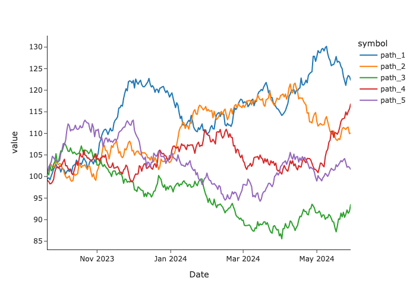
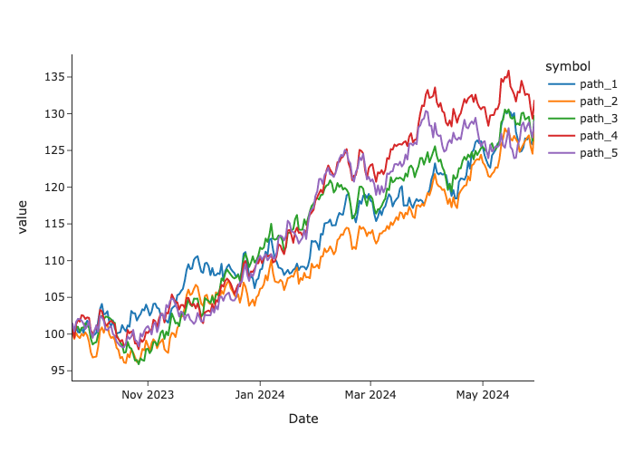

<a name="readme-top"></a>

<!-- PROJECT LOGO -->
```
                                                                                                                                                                                           
                                                                                                                                                                                           
   SSSSSSSSSSSSSSS                                               tttt         hhhhhhh                                          tttt            iiii                                        
 SS\:\:\:\:\:\:\:\:\:\:\:\:\:\:\:S                                           ttt\:\:\:t         h\:\:\:\:\:h                                       ttt\:\:\:t           i\:\:\:\:i                                       
S\:\:\:\:\:SSSSSS\:\:\:\:\:\:S                                           t\:\:\:\:\:t         h\:\:\:\:\:h                                       t\:\:\:\:\:t            iiii                                        
S\:\:\:\:\:S     SSSSSSS                                           t\:\:\:\:\:t         h\:\:\:\:\:h                                       t\:\:\:\:\:t                                                        
S\:\:\:\:\:S      yyyyyyy           yyyyyyynnnn  nnnnnnnn    ttttttt\:\:\:\:\:ttttttt    h\:\:\:\:h hhhhh           eeeeeeeeeeee    ttttttt\:\:\:\:\:ttttttt    iiiiiii     cccccccccccccccc  aaaaaaaaaaaaa   
S\:\:\:\:\:S       y\:\:\:\:\:y         y\:\:\:\:\:y n\:\:\:nn\:\:\:\:\:\:\:\:nn  t\:\:\:\:\:\:\:\:\:\:\:\:\:\:\:\:\:t    h\:\:\:\:hh\:\:\:\:\:hhh      ee\:\:\:\:\:\:\:\:\:\:\:\:ee  t\:\:\:\:\:\:\:\:\:\:\:\:\:\:\:\:\:t    i\:\:\:\:\:i   cc\:\:\:\:\:\:\:\:\:\:\:\:\:\:\:c  a\:\:\:\:\:\:\:\:\:\:\:\:a  
 S\:\:\:\:SSSS     y\:\:\:\:\:y       y\:\:\:\:\:y  n\:\:\:\:\:\:\:\:\:\:\:\:\:\:nn t\:\:\:\:\:\:\:\:\:\:\:\:\:\:\:\:\:t    h\:\:\:\:\:\:\:\:\:\:\:\:\:\:hh   e\:\:\:\:\:\:eeeee\:\:\:\:\:eet\:\:\:\:\:\:\:\:\:\:\:\:\:\:\:\:\:t     i\:\:\:\:i  c\:\:\:\:\:\:\:\:\:\:\:\:\:\:\:\:\:c  aaaaaaaaa\:\:\:\:\:a 
  SS\:\:\:\:\:\:SSSSS y\:\:\:\:\:y     y\:\:\:\:\:y   nn\:\:\:\:\:\:\:\:\:\:\:\:\:\:\:ntttttt\:\:\:\:\:\:\:tttttt    h\:\:\:\:\:\:\:hhh\:\:\:\:\:\:h e\:\:\:\:\:\:e     e\:\:\:\:\:etttttt\:\:\:\:\:\:\:tttttt     i\:\:\:\:i c\:\:\:\:\:\:\:cccccc\:\:\:\:\:c           a\:\:\:\:a 
    SSS\:\:\:\:\:\:\:\:SSy\:\:\:\:\:y   y\:\:\:\:\:y      n\:\:\:\:\:nnnn\:\:\:\:\:n      t\:\:\:\:\:t          h\:\:\:\:\:\:h   h\:\:\:\:\:\:he\:\:\:\:\:\:\:eeeee\:\:\:\:\:\:e      t\:\:\:\:\:t           i\:\:\:\:i c\:\:\:\:\:\:c     ccccccc    aaaaaaa\:\:\:\:\:a 
       SSSSSS\:\:\:\:Sy\:\:\:\:\:y y\:\:\:\:\:y       n\:\:\:\:n    n\:\:\:\:n      t\:\:\:\:\:t          h\:\:\:\:\:h     h\:\:\:\:\:he\:\:\:\:\:\:\:\:\:\:\:\:\:\:\:\:\:e       t\:\:\:\:\:t           i\:\:\:\:i c\:\:\:\:\:c               aa\:\:\:\:\:\:\:\:\:\:\:\:a 
            S\:\:\:\:\:Sy\:\:\:\:\:y\:\:\:\:\:y        n\:\:\:\:n    n\:\:\:\:n      t\:\:\:\:\:t          h\:\:\:\:\:h     h\:\:\:\:\:he\:\:\:\:\:\:eeeeeeeeeee        t\:\:\:\:\:t           i\:\:\:\:i c\:\:\:\:\:c              a\:\:\:\:aaaa\:\:\:\:\:\:a 
            S\:\:\:\:\:S y\:\:\:\:\:\:\:\:\:y         n\:\:\:\:n    n\:\:\:\:n      t\:\:\:\:\:t    tttttth\:\:\:\:\:h     h\:\:\:\:\:he\:\:\:\:\:\:\:e                 t\:\:\:\:\:t    tttttt i\:\:\:\:i c\:\:\:\:\:\:c     ccccccca\:\:\:\:a    a\:\:\:\:\:a 
SSSSSSS     S\:\:\:\:\:S  y\:\:\:\:\:\:\:y          n\:\:\:\:n    n\:\:\:\:n      t\:\:\:\:\:\:tttt\:\:\:\:\:th\:\:\:\:\:h     h\:\:\:\:\:he\:\:\:\:\:\:\:\:e                t\:\:\:\:\:\:tttt\:\:\:\:\:ti\:\:\:\:\:\:ic\:\:\:\:\:\:\:cccccc\:\:\:\:\:ca\:\:\:\:a    a\:\:\:\:\:a 
S\:\:\:\:\:\:SSSSSS\:\:\:\:\:S   y\:\:\:\:\:y           n\:\:\:\:n    n\:\:\:\:n      tt\:\:\:\:\:\:\:\:\:\:\:\:\:\:th\:\:\:\:\:h     h\:\:\:\:\:h e\:\:\:\:\:\:\:\:eeeeeeee        tt\:\:\:\:\:\:\:\:\:\:\:\:\:\:ti\:\:\:\:\:\:i c\:\:\:\:\:\:\:\:\:\:\:\:\:\:\:\:\:ca\:\:\:\:\:aaaa\:\:\:\:\:\:a 
S\:\:\:\:\:\:\:\:\:\:\:\:\:\:\:SS   y\:\:\:\:\:y            n\:\:\:\:n    n\:\:\:\:n        tt\:\:\:\:\:\:\:\:\:\:\:tth\:\:\:\:\:h     h\:\:\:\:\:h  ee\:\:\:\:\:\:\:\:\:\:\:\:\:e          tt\:\:\:\:\:\:\:\:\:\:\:tti\:\:\:\:\:\:i  cc\:\:\:\:\:\:\:\:\:\:\:\:\:\:\:c a\:\:\:\:\:\:\:\:\:\:aa\:\:\:a
 SSSSSSSSSSSSSSS    y\:\:\:\:\:y             nnnnnn    nnnnnn          ttttttttttt  hhhhhhh     hhhhhhh    eeeeeeeeeeeeee            ttttttttttt  iiiiiiii    cccccccccccccccc  aaaaaaaaaa  aaaa
                   y\:\:\:\:\:y                                                                                                                                                                 
                  y\:\:\:\:\:y                                                                                                                                                                  
                 y\:\:\:\:\:y                                                                                                                                                                   
                y\:\:\:\:\:y                                                                                                                                                                    
               yyyyyyy                                                                                                                                                                     
                                                                                                                                                                                           

```

<!-- TABLE OF CONTENTS -->
<details>
  <summary>Table of Contents</summary>
  <ol>
    <li>
      <a href="#about-the-project">About The Project</a>
        <ul>
            <li><a href="#introduction">Introduction</a></li>
        </ul>
        <ul>
            <li><a href="#built-with">Built With</a></li>
        </ul>
    </li>
    <li><a href="#installation">Installation</a></li>
    <li><a href="#getting-started">Getting Started</a></li>
    <li><a href="#contributing">Contributing</a></li>
    <li><a href="#license">License</a></li>
  </ol>
</details>


<!-- ABOUT THE PROJECT -->
## About The Project

### Introduction

`Synthetica` is a versatile and robust tool for generating synthetic time series data. Whether you are engaged in financial modeling, IoT data simulation, or any project requiring realistic time series data to create correlated or uncorrelated signals, `Synthetica` provides high-quality, customizable generated datasets. Leveraging advanced statistical techniques and machine learning algorithms, `Synthetica` produces synthetic data that closely replicates the characteristics and patterns of real-world data.

The project latest version incorporates a wide array of models, offering an extensive toolkit for generating synthetic time series data. This version includes features like:

* `GeometricBrownianMotion`
* `AR` (Autoregressive)
* `NARMA` (Non-Linear Autoregressive Moving Average)
* `Heston`
* `CIR`
* `LevyStable`
* `MeanReverting`
* `Merton`
* `Poisson`
* `Seasonal`

However, the `SyntheticaAdvenced` version elevates the capabilities further, integrating more sophisticated deep learning data-driven algorithms, such as TimeGAN.

<p align="right">(<a href="#readme-top">back to top</a>)</p>

### Built With

* `numpy = "^1.26.4"`
* `pandas = "^2.2.2"`
* `scipy = "^1.13.1"`

<p align="right">(<a href="#readme-top">back to top</a>)</p>

<!-- GETTING STARTED -->
## Installation

To get started with `Synthetica`, you can clone the repository to your local machine. Ensure you have Git installed, then run the following command:

```sh
$ git clone https://github.com/ActurialCapital/synthetica.git
```

<p align="right">(<a href="#readme-top">back to top</a>)</p>

<!-- USAGE EXAMPLES -->
## Getting Started

Once you have cloned the repository, you can start using `Synthetica` to generate synthetic time series data. Here are some initial steps to help you kickstart your exploration:

```python
>>> import synthetica as sth
```

In this example, we are using the following parameters for illustration purposes:

* `length=252`: The length of the time series
* `num_paths=2`: The number of paths to generate
* `seed=123`: Reseed the `numpy` singleton `RandomState` instance for reproduction

Additionally, we'll create a correlation matrix to establish a basket of correlated asset paths using the Cholesky decomposition method:

```python
>>> matrix = np.array([[1, 0.8, 0.6, 0.4, 0.2],
                       [0.8, 1, 0.8, 0.6, 0.4],
                       [0.6, 0.8, 1, 0.8, 0.6],
                       [0.4, 0.6, 0.8, 1, 0.8],
                       [0.2, 0.4, 0.6, 0.8, 1]])
```

Using the `GeometricBrownianMotion` model:

```python
>>> model = sth.GeometricBrownianMotion(length=252, num_paths=2, seed=123)
```

Generate random signals:

```python
>>> model.transform()
```

<p align="center"></p>

Generate correlated asset paths using the Cholesky decomposition method with the same random seed:

```python
>>> df = model.transform(matrix)
```

<p align="center"></p>


<p align="right">(<a href="#readme-top">back to top</a>)</p>

<!-- CONTRIBUTING -->
## Contributing

Contributions are what make the open source community such an amazing place to learn, inspire, and create. Any contributions you make are **greatly appreciated**.

If you have a suggestion that would make this better, please fork the repo and create a pull request. You can also simply open an issue with the tag "enhancement".
Don't forget to give the project a star! Thanks again!

1. Fork the Project
2. Create your Feature Branch (`git checkout -b feature/AmazingFeature`)
3. Commit your Changes (`git commit -m 'Add some AmazingFeature'`)
4. Push to the Branch (`git push origin feature/AmazingFeature`)
5. Open a Pull Request

<p align="right">(<a href="#readme-top">back to top</a>)</p>


<!-- LICENSE -->
## License

Distributed under the BSD-3 License. See `LICENSE.txt` for more information.

<p align="right">(<a href="#readme-top">back to top</a>)</p>

